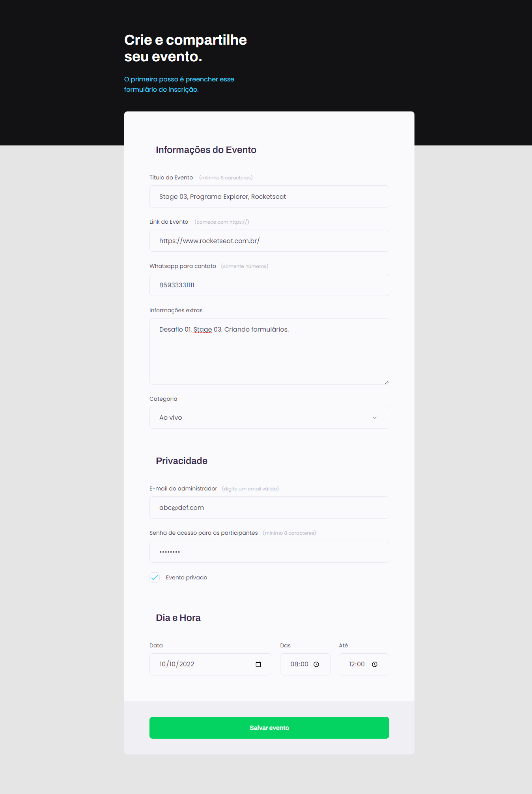

# Project 04 - Rocketseat, Explorer Program, Class 06. 

Project developed during the Stage 03 of Explorer Program, in Oct/22.
Challenge 01 - Creating Forms.

🔗 [Click here to access](https://renato-albuquerque.github.io/projeto-04-explorer/)

## Technologies

- HTML
- CSS
- Git and Github

## Contact

🔗 [Linkedin](https://www.linkedin.com/in/renato-malbuquerque/)
🔗 [Business Card](https://rma-contacts.vercel.app/)
🔗 [Portfolio](https://portfolio-renatoalbuquerque.vercel.app/)
🔗 [Discord](https://discordapp.com/users/992621595547938837)